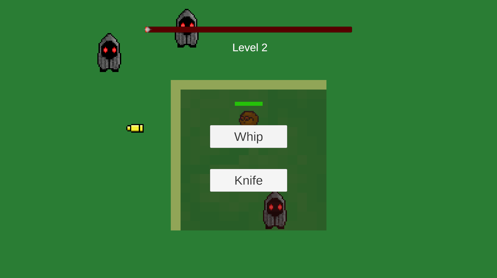
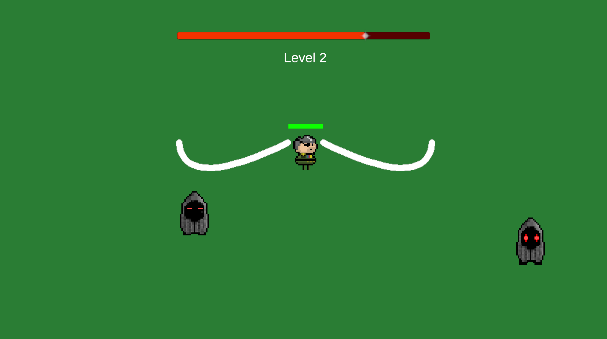

# SurvivorsClone
 I'm making a vampire survivors without copy-paste. I am applying programming principles I have learned like S.O.L.I.D. in this project. I used Scriptable Objects, Action/Events, State Machines, Enumerators. 
 
 The patterns I used: Singleton Pattern, Flyweight Pattern, State Pattern, Prototype Pattern. 

 There is two types of enemy, two types of player character (General and Scientist). General's HP greater than Scientist. Scientist move speed faster than General. General's default weapon is Whip, Scientist's default weapon is knife. 

## Screenshots

    
